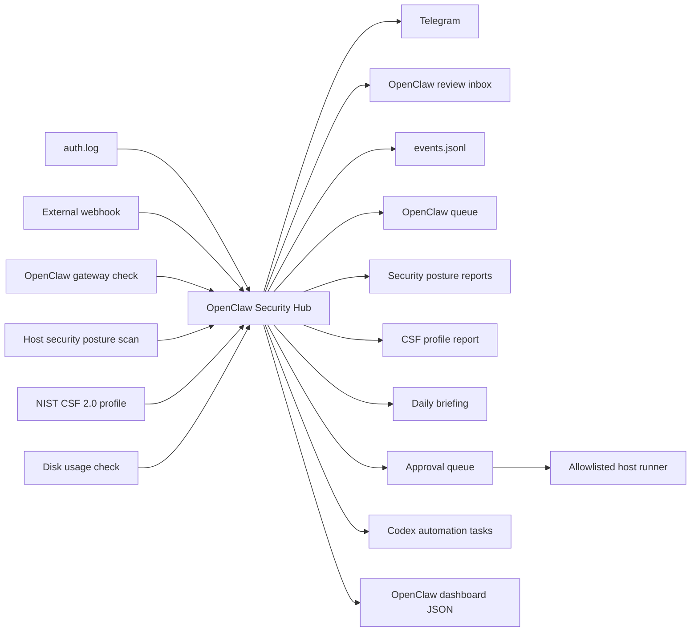

# OpenClaw Security Hub

OpenClaw Security Hub is a clean homelab security workflow built around OpenClaw as the review workspace.

It receives alerts, watches local SSH failures, checks the OpenClaw gateway, scans local security posture, creates Telegram notifications, and writes structured review notes into the OpenClaw workspace.

## What It Does

- Receives webhook alerts with a request-header secret.
- Monitors `/var/log/auth.log` for repeated SSH login failures.
- Checks whether the OpenClaw gateway is reachable.
- Checks root disk usage.
- Scans local security posture from host `/proc`, SSH configuration, disk usage, and OpenClaw reachability.
- Produces a NIST CSF 2.0-aligned Current/Target Profile with current evidence, gaps, priorities, and next actions.
- Sends Telegram alerts.
- Accepts Telegram commands for scans, remediation requests, approval, and Codex automation task creation.
- Creates OpenClaw review notes in `~/.openclaw/workspace/security-alerts/inbox`.
- Writes event history to `~/.openclaw/workspace/security-alerts/events/events.jsonl`.
- Writes OpenClaw's current work queue to `~/.openclaw/workspace/security-alerts/queue/queue.json`.
- Writes a human-readable queue summary to `~/.openclaw/workspace/security-alerts/latest.md`.
- Writes dashboard data to `~/.openclaw/workspace/dashboard/security-alerts.json`.
- Generates daily security briefings in `~/.openclaw/workspace/security-alerts/briefings`.
- Generates security posture reports in `~/.openclaw/workspace/security-alerts/reports`.
- Generates NIST CSF 2.0 profile reports and gap backlog files.
- Maintains an allowlisted remediation queue in `~/.openclaw/workspace/security-alerts/queue/remediation-requests.json`.
- Creates Codex automation task files in `~/.openclaw/workspace/security-alerts/codex-automation/pending`.

## Architecture



## Run

```bash
cp .env.example .env
docker compose up -d --build
```

## Test

```bash
scripts/test-alert.sh
scripts/security-scan.sh
scripts/nist-csf-check.sh
scripts/generate-briefing.sh
scripts/codex-automation.sh
scripts/remediation-runner.py
scripts/run-tests.sh
```

## API

Protected routes require `X-Security-Hub-Secret`.

- `GET /health` - service health and monitor status.
- `GET /status` - event count, open notes, latest event, and posture summary.
- `POST /webhook/generic` - receive a normalized alert.
- `POST /scan/security` - run a security posture scan now.
- `POST /scan/nist-csf` - run a NIST CSF 2.0-aligned self-assessment.
- `GET /queue` - read OpenClaw's current security work queue.
- `POST /briefing/daily` - generate a daily briefing.
- `POST /telegram/webhook` - process a Telegram update payload if webhook mode is used.
- `GET /remediation/requests` - list remediation requests and allowlisted playbooks.
- `POST /remediation/request` - create an allowlisted remediation request.
- `POST /remediation/{id}/approve` - approve a remediation request.
- `POST /automation/codex` - create a Codex automation task file from the current queue.

## Telegram Commands

When `ENABLE_TELEGRAM_COMMANDS=true`, the hub polls Telegram for commands from
the configured chat. This avoids exposing a public webhook.

- `/scan` - run security and NIST scans.
- `/harden` - create remediation requests from current allowlisted findings.
- `/queue` - show pending remediation requests.
- `/approve <id>` - approve a remediation request.
- `/codex` - create a Codex automation task file.
- `/briefing` - generate the daily briefing.

Host-level actions are not executed directly by Telegram. After approval, run:

```bash
scripts/remediation-runner.py
```

The runner executes only known playbooks and then verifies with security and NIST scans.

## NIST CSF 2.0 Alignment

The CSF scan is a self-assessment for a personal homelab. It is not a certification or formal compliance attestation.

The scan maps available evidence to representative NIST CSF 2.0 outcomes across GOVERN, IDENTIFY, PROTECT, DETECT, RESPOND, and RECOVER. Automated evidence is used where possible. Governance, policy, and recovery outcomes are marked for manual review when they require human-owned evidence.

The generated profile uses:

- Current Profile: what the available homelab evidence supports today.
- Target Profile: the intended baseline for a repeatable, reviewable homelab security workflow.
- Gap Backlog: prioritized actions with owner, due field, gap text, and next action.

## Current Host Paths

- Project: `~/openclaw-security-hub`
- OpenClaw inbox: `~/.openclaw/workspace/security-alerts/inbox`
- Security queue: `~/.openclaw/workspace/security-alerts/queue/queue.json`
- NIST CSF profile JSON: `~/.openclaw/workspace/security-alerts/queue/nist-csf-profile.json`
- NIST CSF gap backlog: `~/.openclaw/workspace/security-alerts/queue/nist-csf-gap-backlog.json`
- Remediation queue: `~/.openclaw/workspace/security-alerts/queue/remediation-requests.json`
- Codex automation tasks: `~/.openclaw/workspace/security-alerts/codex-automation/pending`
- Latest queue summary: `~/.openclaw/workspace/security-alerts/latest.md`
- Security reports: `~/.openclaw/workspace/security-alerts/reports`
- Briefings: `~/.openclaw/workspace/security-alerts/briefings`
- Dashboard JSON: `~/.openclaw/workspace/dashboard/security-alerts.json`

Runtime secrets stay in `.env` and are ignored by Git.

## Scan Tuning

The default posture scan ignores Tailscale IPv6 high ephemeral ports to avoid false positives from `tailscaled` itself. Set `IGNORE_TAILSCALE_EPHEMERAL_TCP_PORTS=false` in `.env` for a stricter review mode.
