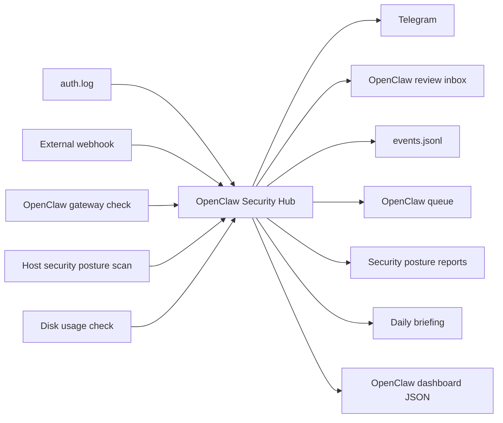

# OpenClaw Security Hub

OpenClaw Security Hub is a clean homelab security workflow built around OpenClaw as the review workspace.

It receives alerts, watches local SSH failures, checks the OpenClaw gateway, scans local security posture, creates Telegram notifications, and writes structured review notes into the OpenClaw workspace.

## What It Does

- Receives webhook alerts with a request-header secret.
- Monitors `/var/log/auth.log` for repeated SSH login failures.
- Checks whether the OpenClaw gateway is reachable.
- Checks root disk usage.
- Scans local security posture from host `/proc`, SSH configuration, disk usage, and OpenClaw reachability.
- Sends Telegram alerts.
- Creates OpenClaw review notes in `~/.openclaw/workspace/security-alerts/inbox`.
- Writes event history to `~/.openclaw/workspace/security-alerts/events/events.jsonl`.
- Writes OpenClaw's current work queue to `~/.openclaw/workspace/security-alerts/queue/queue.json`.
- Writes a human-readable queue summary to `~/.openclaw/workspace/security-alerts/latest.md`.
- Writes dashboard data to `~/.openclaw/workspace/dashboard/security-alerts.json`.
- Generates daily security briefings in `~/.openclaw/workspace/security-alerts/briefings`.
- Generates security posture reports in `~/.openclaw/workspace/security-alerts/reports`.

## Architecture



## Run

```bash
cp .env.example .env
docker compose up -d --build
```

## Test

```bash
scripts/test-alert.sh
scripts/security-scan.sh
scripts/generate-briefing.sh
scripts/run-tests.sh
```

## API

Protected routes require `X-Security-Hub-Secret`.

- `GET /health` - service health and monitor status.
- `GET /status` - event count, open notes, latest event, and posture summary.
- `POST /webhook/generic` - receive a normalized alert.
- `POST /scan/security` - run a security posture scan now.
- `GET /queue` - read OpenClaw's current security work queue.
- `POST /briefing/daily` - generate a daily briefing.

## Current Host Paths

- Project: `~/openclaw-security-hub`
- OpenClaw inbox: `~/.openclaw/workspace/security-alerts/inbox`
- Security queue: `~/.openclaw/workspace/security-alerts/queue/queue.json`
- Latest queue summary: `~/.openclaw/workspace/security-alerts/latest.md`
- Security reports: `~/.openclaw/workspace/security-alerts/reports`
- Briefings: `~/.openclaw/workspace/security-alerts/briefings`
- Dashboard JSON: `~/.openclaw/workspace/dashboard/security-alerts.json`

Runtime secrets stay in `.env` and are ignored by Git.

## Scan Tuning

The default posture scan ignores Tailscale IPv6 high ephemeral ports to avoid false positives from `tailscaled` itself. Set `IGNORE_TAILSCALE_EPHEMERAL_TCP_PORTS=false` in `.env` for a stricter review mode.
