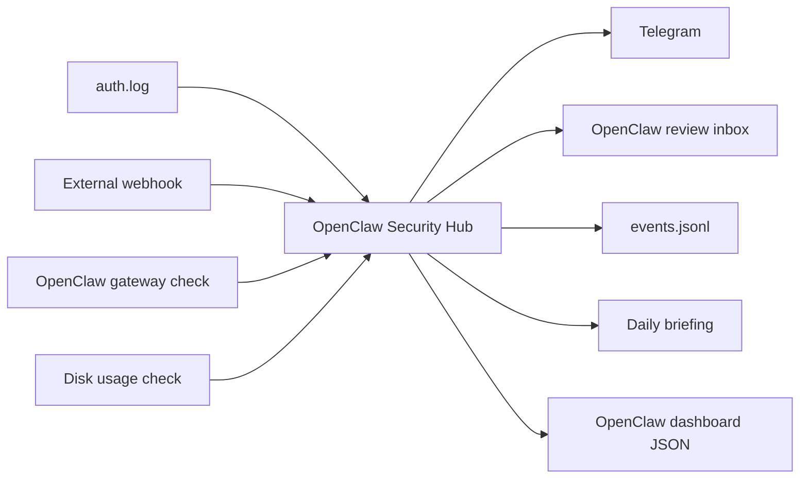

# OpenClaw Security Hub

OpenClaw Security Hub is a clean homelab security workflow built around OpenClaw as the review workspace.

It receives alerts, watches local SSH failures, checks the OpenClaw gateway, creates Telegram notifications, and writes structured review notes into the OpenClaw workspace.

## What It Does

- Receives webhook alerts with a request-header secret.
- Monitors `/var/log/auth.log` for repeated SSH login failures.
- Checks whether the OpenClaw gateway is reachable.
- Checks root disk usage.
- Sends Telegram alerts.
- Creates OpenClaw review notes in `~/.openclaw/workspace/security-alerts/inbox`.
- Writes event history to `~/.openclaw/workspace/security-alerts/events/events.jsonl`.
- Writes dashboard data to `~/.openclaw/workspace/dashboard/security-alerts.json`.
- Generates daily security briefings in `~/.openclaw/workspace/security-alerts/briefings`.

## Architecture



## Run

```bash
cp .env.example .env
docker compose up -d --build
```

## Test

```bash
scripts/test-alert.sh
scripts/generate-briefing.sh
```

## Current Host Paths

- Project: `~/openclaw-security-hub`
- OpenClaw inbox: `~/.openclaw/workspace/security-alerts/inbox`
- Briefings: `~/.openclaw/workspace/security-alerts/briefings`
- Dashboard JSON: `~/.openclaw/workspace/dashboard/security-alerts.json`

Runtime secrets stay in `.env` and are ignored by Git.
